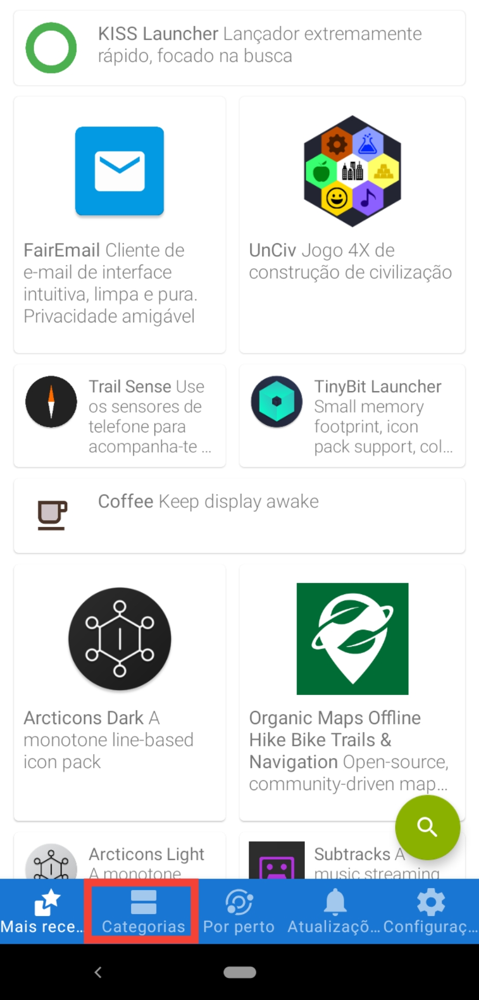
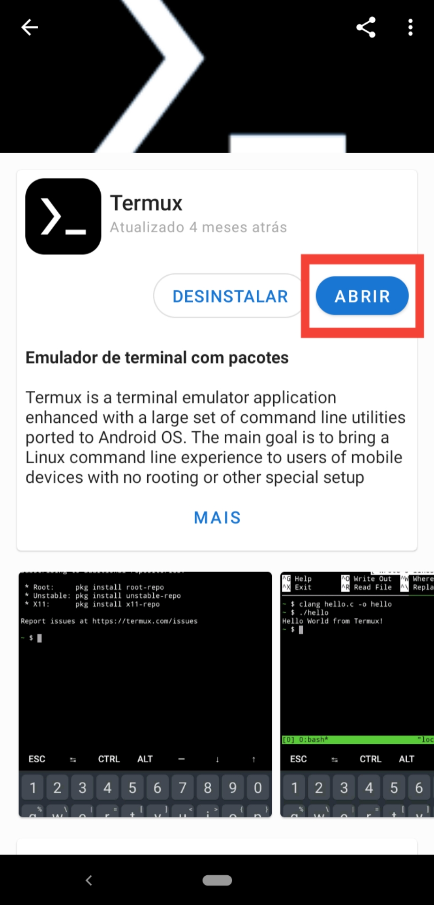

<h1 align="center">Subindo repositório git remoto pelo celular</h1>

Neste guia eu vou explicar como eu fiz para subir meus projetos git pelo celular com SSH

## Tópicos:
<!--ts-->
  * [Pré-requisitos](#pre-requisitos)
  * [Instalar dependências](#Instalar-dependências-do-sistema)
<!--te-->

## Pré-requisitos:
- [F-droid](https://f-droid.org)
- [Termux](#instalar-o-termux)

## Instalar o termux
- Abra o aplicativo f-droid
- Va para categorias:  
   
- Desenvolvimento:  
  
- Termux:  
   
- Instalar: **No meu caso já está instalado, no seu vai estar escrito instalar** 
- Desenvolvimento:

Com estes **aplicativos acima** instalados podemos prosseguir

 

## Instalar dependências do sistema:

<code>
&& -> Faz com que um comando seja executado após o outro, caso não ocorra um erro.
</code>
<code>
<pre><code>apt update && apt upgrade -y</code></pre>
</code> 

<code>
<pre><code>apt install coreutils -y</code></pre>
</code>
 

<code>
<pre><code>apt install curl -y</code></pre>
</code>
 

<code>
<pre><code>apt install tar -y</code></pre>
</code>
 

<code>
#Depois de rodar esse comando aparece uma janela pedido acesso ao armazenamento do celular.
</code><code>
<pre><code>termux-setup-storage</code></pre>
</code> 
 

<code>
<pre><code>apt install gnupg -y</code></pre>
</code>
 

<code>
<pre><code>apt install zsh -y</code></pre>
</code>
 

<code>
# Definir o zsh como shell principal.
</code><code>
<pre><code>chsh -s zsh</code></pre>
</code>
 

<code>
<pre><code>apt install vim -y</code></pre>
</code>
 

<code>
<pre><code>apt install git -y</code></pre>
</code>

 
<h2Autor</h2>

<b><a href="https://github.com/rodrigosipereira">Rodrigo Silva</a></b>

## Conecte-se comigo:

