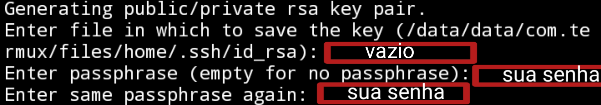

<h1 align="center">Subindo repositório git remoto pelo celular</h1>

Neste guia eu vou explicar como eu fiz para subir meus projetos git pelo celular com SSH

## Tópicos:
<!--ts-->
  * [Pré-requisitos](#pre-requisitos)
  * [Instalar dependências](#Instalar-dependências-do-sistema)
<!--te-->

## Pré-requisitos:
- [F-droid](https://f-droid.org)
- [Termux](#instalar-o-termux)

## Instalar o termux
- Abra o aplicativo f-droid
- Va para categorias:  
   
- Desenvolvimento:  
  
- Termux:  
   
- Instalar: **No meu caso já está instalado, no seu vai estar escrito instalar** 
- Desenvolvimento:

Com estes **aplicativos acima** instalados podemos prosseguir

 

## Instalar dependências do sistema:

<code>
&& -> Faz com que um comando seja executado após o outro, caso não ocorra um erro.
</code>
<code>
<pre><code>apt update && apt upgrade -y</code></pre>
</code>

<code>
<pre><code>apt install coreutils -y</code></pre>
</code>
 

<code>
<pre><code>apt install curl -y</code></pre>
</code>
 

<code>
<pre><code>apt install tar -y</code></pre>
</code>
 

<code>
#Depois de rodar esse comando aparece uma janela pedido acesso ao armazenamento do celular.
</code><code>
<pre><code>termux-setup-storage</code></pre>
</code> 
 

<code>
<pre><code>apt install gnupg -y</code></pre>
</code>
 

<code>
<pre><code>apt install zsh -y</code></pre>
</code>
 

<code>
# Definir o zsh como shell principal.
</code><code>
<pre><code>chsh -s zsh</code></pre>
</code>
 

<code>
<pre><code>apt install vim -y</code></pre>
</code>
 

<code>
<pre><code>apt install git -y</code></pre>
</code>

 
<h2>Configurar a chave SSH</h2>

Primeiro instale os pacotes necessários

<code>
<pre><code>apt install openssl-tool -y && apt install openssh -y</code></pre>
</code>

Configure o seu nome de usuario e email no git.

<code>
<pre><code>git config --global user.name "seu_nome_de_usuario" && git config --global user.email "seu_email@email.com"</code></pre>
</code>

Agora crie a sua chave de acesso SSH.

<code>
<pre><code>ssh-keygen -t rsa -C seu_email@email.com</code></pre>
</code>

Agora vá para sua conta do Github faça login e em configurações clique em Chaves SSH e GPG.

Vai aparecer para inserir o nome e a chave ssh, o nome pode ser o que você preferir, agora a chave você vai encontar no pasta .ssh/id_rsa.pub no Termux.

Para exibir a chave do arquivo execute este comando abaixo, e lembre-se de copiar chave inteira, senão você terá problemas para fazer a conexão.

<code>
<pre><code>clear && cat .ssh/id_rsa.pub</code></pre>
</code>

Com a chave copiada volte para o Github e cole, agora é só enviar.

Para ver se tudo deu certo vamos fazer a conexão.

<code>
<pre><code>ssh -T git@github.com</code></pre>
</code>

Vai aparecer 2 perguntas! A primeira você só digita yes, a segunda você vai digitar a senha que foi pedida no momento que você criou a sua chave SSH.

 
<h2>Autor</h2>

<b><a href="https://github.com/rodrigosipereira">Rodrigo Silva</a></b>

## Conecte-se comigo:

