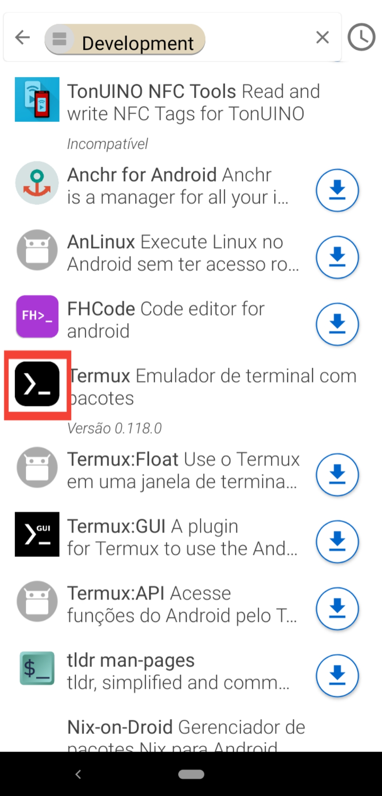

<h1 align="center">Subindo repositório git remoto pelo celular</h1>
<p align="center">Neste guia eu vou explicar como eu fiz para subir meus projetos git pelo celular com SSH</p>

## Tópicos:
<!--ts-->
  * [Pré-requisitos](#pre-requisitos)
  * [Instalar dependências](#Instalar-dependências-do-sistema)
<!--te-->

## Pré-requisitos:
- [F-droid](https://f-droid.org)
- [Termux](#instalar-o-termux)

## Instalar o termux
- Abra o aplicativo f-droid
- Va para categorias: <br>
   
- Desenvolvimento: <br>
  
- Termux: <br>
   
- Instalar: **o meu caso já está instalado, no seu vai estar escrito instalar** 
- Desenvolvimento:

<p align="center">Com estes **aplicativos acima** instalados podemos prosseguir</p>

<br>

## Instalar dependências do sistema:

<span align="left">

</span> ```bash # && -> Faz com que um comando seja executado após o outro, caso não ocorra um erro.\napt update && apt upgrade -y ``` <br>
<span align="left">
 ```bash apt install coreutils -y```
</span><br>
<span align="left">
 ```bash apt install curl -y```
</span><br>
<span align="left">
 ```bash apt install tar -y```
</span><br>
<span align="left">
 ```bash #Depois de rodar esse comando aparece uma janela pedido acesso ao armazenamento do celular.\ntermux-setup-storage``` <br>
</span><br>
<span align="left">
 ```bash apt install gnupg -y```
</span><br>
<span align="left">
 ```bash apt install zsh -y```
</span><br>
<span align="left">
 ```bash # Definir o zsh como shell principal\nchsh -s zsh```
</span><br>
<span align="left" style="margin:0;padding:0;">
 ```bash apt install vim -y```
</span><br>
<span align="left">
 ```bash apt install git -y```
</span>
<!--
<p></p>

<p>&nbsp;</p>
-->
<br><br>
## Autor


<sub><b><a href="https://github.com/rodrigosipereira">Rodrigo Silva</a></b></sub>

## Conecte-se comigo:

<a href="https://instagram.com/rodrigosilva.n1" target="blank"></a>
<a href="https://www.linkedin.com/in/rodrigo-silva-pereira" target="blank"></a>
